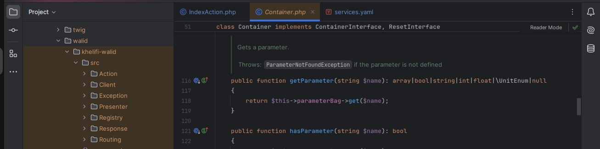

# Hello World!, I'm KHELIFI Walid, a Tunisian Web Developer 👋🏼:
Experienced Web Developer, specialized in native PHP, MVC architecture, as well as development with Laravel and Symfony frameworks.
Passionate about IT, I prioritize user experience, development quality, and teamwork.
Beyond my development expertise, I integrate DevSecOps practices at every stage of the process to ensure the robustness and reliability of applications.

<picture>
  <source media="(prefers-color-scheme: dark)" srcset="https://raw.githubusercontent.com/tobiasmeyhoefer/tobiasmeyhoefer/output/github-snake-dark.svg" />
  <source media="(prefers-color-scheme: light)" srcset="https://raw.githubusercontent.com/tobiasmeyhoefer/tobiasmeyhoefer/output/github-snake.svg" />
  
</picture>

# 💻 Tech Stack:

A experienced Web Developer

<h2>🚀 Languages and Tools I Use</h2>

<h2>⚡️ Where to find me</h2>

